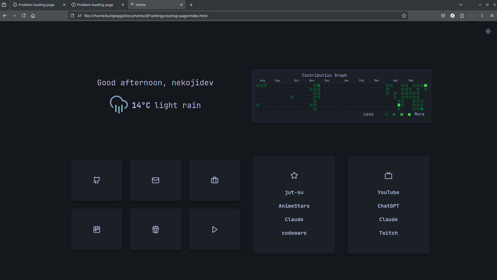

# Startup Page

This is a customizable startup page designed to be your browser's homepage. It features a clock, date, weather display, greetings, quick links, and a GitHub contribution calendar.





## Features

*   **Time and Date Display**: Shows the current time and date.
*   **Weather Widget**: Displays current weather information (requires configuration).
*   **Customizable Greetings**: Greets the user based on the time of day.
*   **Link Sections**: Configurable sections for quick links, categorized as buttons or lists.
*   **GitHub Contribution Calendar**: Shows your GitHub contribution activity.
*   **Themeable**: 
    *   Light and Dark themes.
    *   Automatic theme switching based on OS preference or time of day (configurable).
    *   Option for a static image background.
*   **Responsive Design**: Adapts to different screen sizes, with some elements hidden on smaller screens for better usability.

## Project Structure

```
startup-page/
├── assets/
│   ├── icons/            # SVG icons for themes (Dark, Nord, OneDark, White)
│   └── js/               # JavaScript files for functionality
│       ├── buttons.js      # Generates button links
│       ├── greeting.js     # Handles greetings
│       ├── layout.js       # Manages different layout configurations
│       ├── lists.js        # Generates list links
│       ├── theme.js        # Handles theme switching and persistence
│       ├── time.js         # Manages time and date display
│       └── weather.js      # Handles weather data fetching and display
├── app.css             # Main stylesheet for the page
├── config.js           # Core configuration file for links, weather, themes, etc.
├── index.html          # The main HTML structure of the page
└── README.md           # This file
```

## Setup

1.  **Clone or Download**: Get the project files onto your local machine.
2.  **Configure `config.js`**: This is the most crucial step.
    *   **`USER_NAME`**: Set your name for personalized greetings.
    *   **`WEATHER_API_KEY`**: Obtain an API key from a weather service provider (e.g., OpenWeatherMap) and add it here to enable the weather widget.
    *   **`LATITUDE` / `LONGITUDE`**: Set your location coordinates for accurate weather.
    *   **`BUTTONS` / `LISTS`**: Configure your quick links. See the existing structure in `config.js` for examples.
    *   **Theme Settings (`autoChangeTheme`, `changeThemeByOS`, `changeThemeByHour`, etc.)**: Customize how themes are handled.
    *   **`IMAGE_BACKGROUND`**: Set to `true` if you want to use a custom background image (place it in `assets/background.jpg` or update the path in `app.css`).
3.  **GitHub Calendar**: In `index.html`, around line 85, the GitHub calendar is initialized:
    ```html
    <script>
        GitHubCalendar(".calendar", "YOUR_GITHUB_USERNAME", { 
            responsive: true, 
            global_stats: false,
            tooltips: true
        });
    </script>
    ```
    Replace `"YOUR_GITHUB_USERNAME"` with your actual GitHub username.
4.  **Open `index.html`**: Open the `index.html` file in your browser. You can set this as your browser's homepage.

## Customization

*   **Styling (`app.css`)**: Most visual aspects can be changed in `app.css`. It uses CSS variables for theming, making it easier to adjust colors and fonts.
    *   `--fg`, `--sfg`: Foreground and secondary foreground colors.
    *   `--accent`: Accent color (hovers, highlights).
    *   `--background`, `--cards`: Background and card colors.
    *   These are defined in `:root` (for light theme) and `.darktheme` (for dark theme).
*   **Links and Layout (`config.js`)**: Add, remove, or modify links and change the overall layout of the link sections (`bento`, `lists`, `buttons`).
*   **Icons (`assets/icons/`)**: Icons are used for various parts of the UI. The theme script might switch icon sets based on the theme.
*   **Weather**: Besides API key and location, you can check `assets/js/weather.js` for how data is fetched and displayed if you want to use a different API or change the display.
*   **Background Image**: To change the image background, replace `assets/background.jpg` or update the `--imgbg` variable in `app.css`.

## Key Files for Customization

*   **`index.html`**: Overall structure, script includes, GitHub calendar initialization.
*   **`app.css`**: All styling, theme definitions, responsive design media queries.
*   **`config.js`**: User-specific settings, links, API keys, theme behavior.
*   **`assets/js/theme.js`**: Logic for theme switching and persistence.
*   **`assets/js/layout.js`**: Logic for arranging link blocks.

This startup page provides a solid foundation. Feel free to dive into the code and tailor it further to your preferences! 